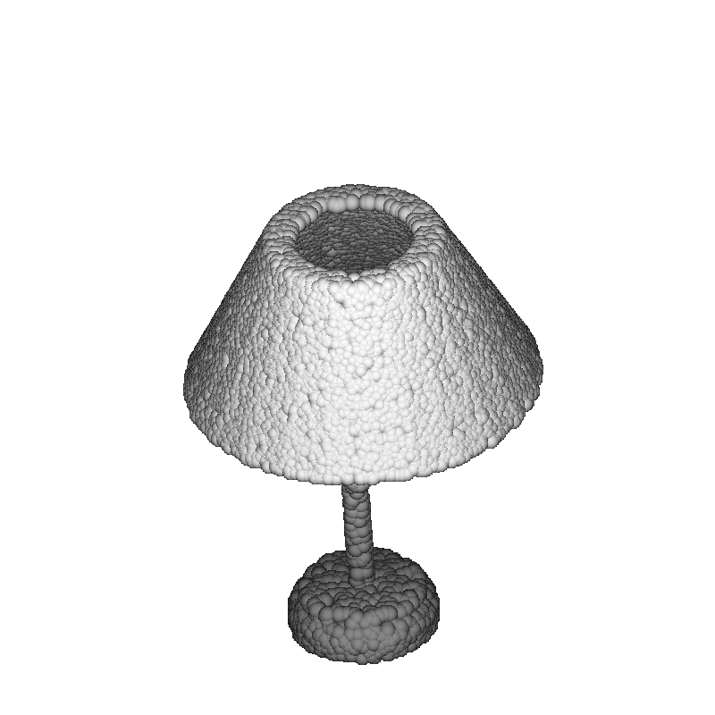

## Pointcloud Visualizer

Point cloud and feature visualization using the visualization tool of [[PointNet++]](https://github.com/charlesq34/pointnet2/) and [[open3d]](https://github.com/intel-isl/Open3D).

- Visualized point cloud example.

- Visualized point cloud feature example.

## Implementation

### Point cloud visualization using the tools of PointNet++

- [Point cloud visualization](./pointcloud_visualization)

### Point cloud feature visualization using open 3d

- [Point cloud feature visualization](./pointcloud_feature_visualization_open3d)

## License

MIT License

### Citation

If you find our work useful in your research, please consider citing ours, [[PointNet++]](https://github.com/charlesq34/pointnet2/), [[open3d]](https://github.com/intel-isl/Open3D) repository.

@ https://github.com/dogyoonlee/pointcloud_visualizer
@ https://github.com/charlesq34/pointnet2/
@ https://github.com/intel-isl/Open3D
