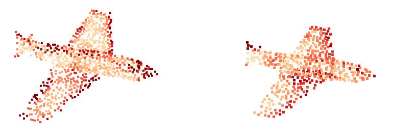

# point cloud feature visualization

**Visualization of feature activation for point cloud data.**

- Visualized point cloud feature example.

<p align="center">

</p>

## How to Use

1. Import and init the implemented class to the target network source code as follow example code.

```
from features_vis_save import feature_vis

self.Visualize_feature = feature_vis()
```

2. Put the xyz and feature tensors in the network and define the layer_name for save.

```
self.Visualize_feature.feature_save(xyz=li_xyz, features=li_features, layer_name=layer_name)
```

3. Visualize using **vis_shapenet.py**(Open3D tool is used) in ./visualization_tool directory.

- We load and visualize the point cloud whose file name was defined in **features_vis_save.py**.
- If you need another rule for filename, revise the according parts of the [vis_shapenet.py](./visualization_tool/vis_shapenet.py) and [features_vis_save.py](./features_vis_save.py)

```
python ./visualization_tool/vis_shapenet.py --file $filename
or
python ./visualization_tool/vis_shapenet.py --args
```

## License

MIT License

## Acknowledgement

This code implemented for shapenet dataset with **open3d tool**.

### Citation

If you find our work useful in your research, please consider citing our repository and [[open3d]](https://github.com/intel-isl/Open3D) repository.

@ https://github.com/dogyoonlee/pointcloud_visualizer

@ https://github.com/intel-isl/Open3D
