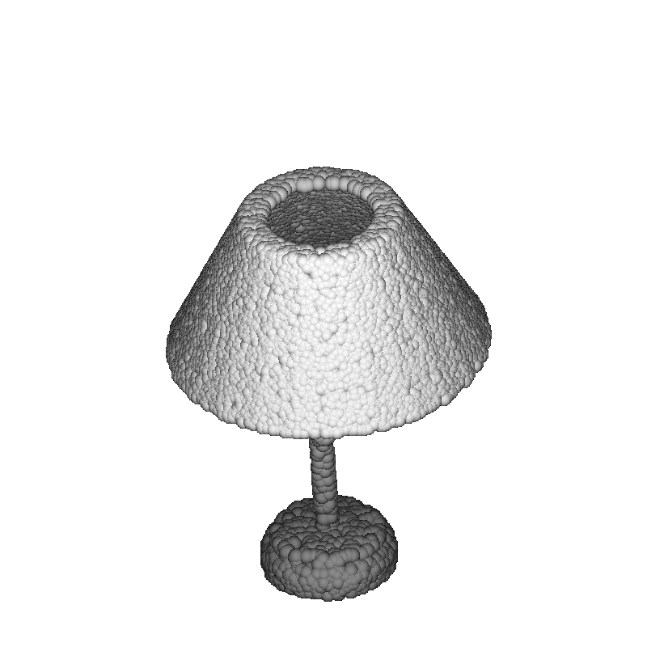

# point cloud visualization

**Visualization of for point cloud data and simple augmentation tool.**

- Visualized point cloud example.
<p align="center">

</p>

## How to Use

1. Complile the visualization code.

```
sh compile_render_balls_so.sh
```

2. Prepare the point cloud data in data folder.

3. If you need augmentation for point cloud (jittering and drop).

- jittered and droped files are saved as $filename_jit and $filename_drop, respectively.

```
python augmentation_tools.py --path $data
```

4. Visualize the point cloud following command.

```
python show3d_balls.py --path $data
```

- If you want background color as black, put the argument `--background_black`

## License

MIT License

## Acknowledgement

This code implemented heavily borrowed from [[PointNet++]](https://github.com/charlesq34/pointnet2/) repository.

### Citation

If you find our work useful in your research, please consider citing our repository and [[PointNet++]](https://github.com/charlesq34/pointnet2/) repository.

@ https://github.com/dogyoonlee/pointcloud_visualizer
@ https://github.com/charlesq34/pointnet2/
